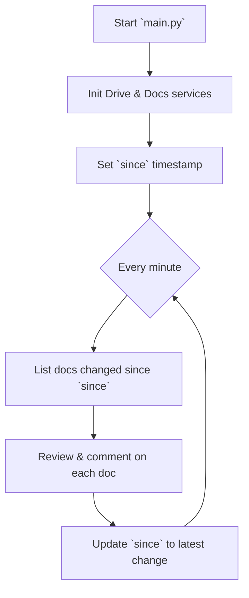
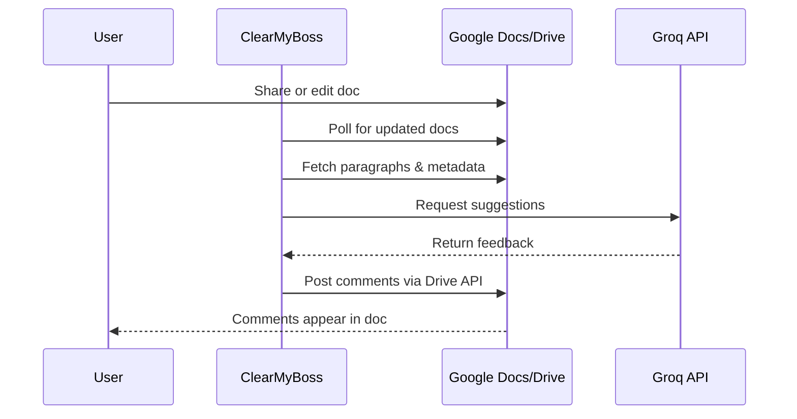

# 📄 ClearMyBoss


ClearMyBoss automatically reviews Google Docs and leaves concise, boss‑like comments powered by Groq's large language models.

---

## 🎯 Objective

Provide an autonomous **"boss" reviewer** that reviews documents shared with a service account and offers direct, helpful feedback without human involvement.

---

## ✨ Features

* 🚀 **Drive & Docs integration** – Polls Google Drive for modified or newly shared docs and retrieves paragraph text.
* 🔍 **Change tracking** – Detects changes by comparing the latest revision with the last reviewed version.
* 🤖 **LLM suggestions** – Sends edited text to Groq's Chat Completions API with chunking, retries, and rate limiting.
* 💬 **Automated comments** – Uses the Google Drive API to anchor comments at precise text offsets.
* 📝 **Context-aware feedback** – Treats a document's description as extra context for the reviewer.
* ♻️ **Revision-aware deduplication** – Stores the last reviewed revision and hashed suggestions in Drive `appProperties` to skip repeated comments.
* ⏱ **Scheduled runner** – Runs `main.py` periodically using the `schedule` library.

---

## 🏗 Architecture

1. **`src/main.py`** – Initializes authenticated services (Drive & Docs) and schedules the review cycle.
2. **`src/google_drive.py`** – Manages file listings, appProperties, revisions, comments, and threads.
3. **`src/google_docs.py`** – Extracts and chunks document paragraphs.
4. **`src/review.py`** – Orchestrates review: change detection → suggestion generation → deduplication → posting.
5. **`src/groq_client.py`** – Handles Groq API requests with retries, chunking, and rate limiting.

---

## 🔄 Workflow





---

## 🛠 Tech Stack

*  Python 3.11
*  Groq Chat Completions API
*  Google Docs & Drive APIs
* `requests`, `schedule`
*  `pytest` for unit testing

---

## ⚙️ Configuration

Environment variables are loaded from `.env`:

| Variable                      | Description |
| ----------------------------- | ------------------------------------------------------------------------------------ |
| `GROQ_API_KEY`                | Groq API token |
| `GOOGLE_SERVICE_ACCOUNT_JSON` | Path to service account credentials with permission to comment on shared Docs |
| `GROQ_CHUNK_SIZE`             | Max bytes per request to Groq (default `20000`) |
| `GROQ_REQUESTS_PER_MINUTE`    | Requests per minute before throttling (default `10`) |
---

## ▶️ Running

Share or edit a Google Doc with the service account in your credentials (it must have permission to comment). Optional: add background context in the file's **Description** field so the reviewer understands the goal.

```bash
pip install -r requirements.txt
python -m src.main
```

* The service checks for new/edited documents every minute.
* `GROQ_REQUESTS_PER_MINUTE` must match your Groq plan limits.
* If exceeded, the client backs off using Groq's `Retry-After` hints.

---

## 🧪 Testing

```bash
pytest
```

---

## 📂 Repository Layout

* `src/` – application source code
* `config/` – environment settings
* `test/` – unit tests
* `PRD.md`, `SprintPlanning.md` – planning docs
